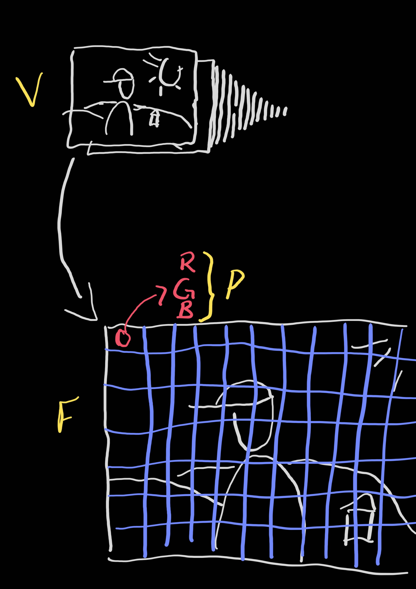
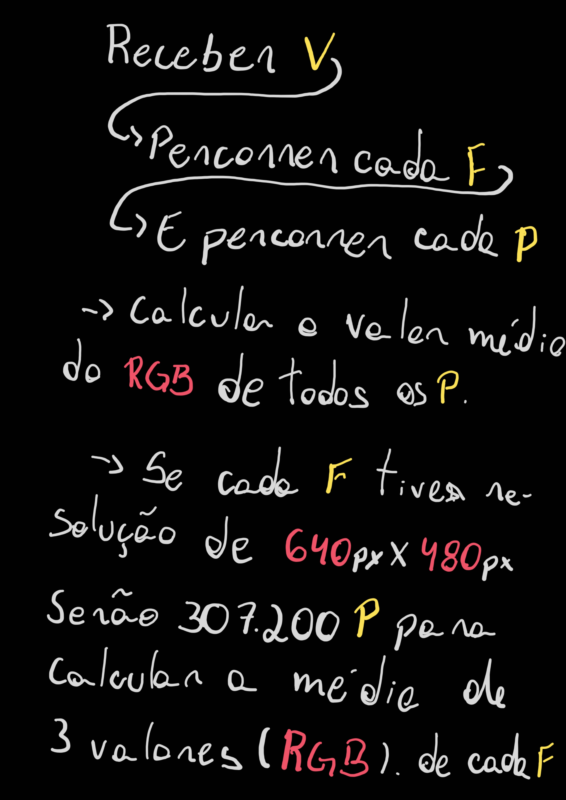
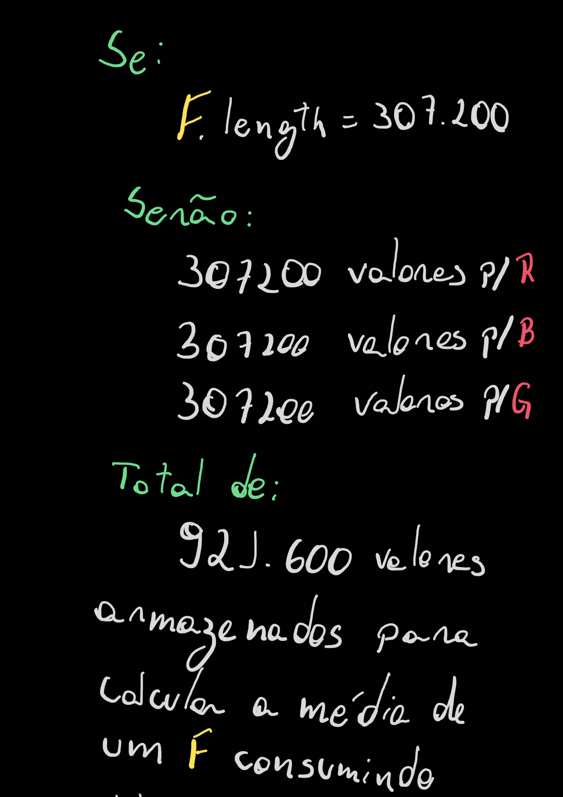
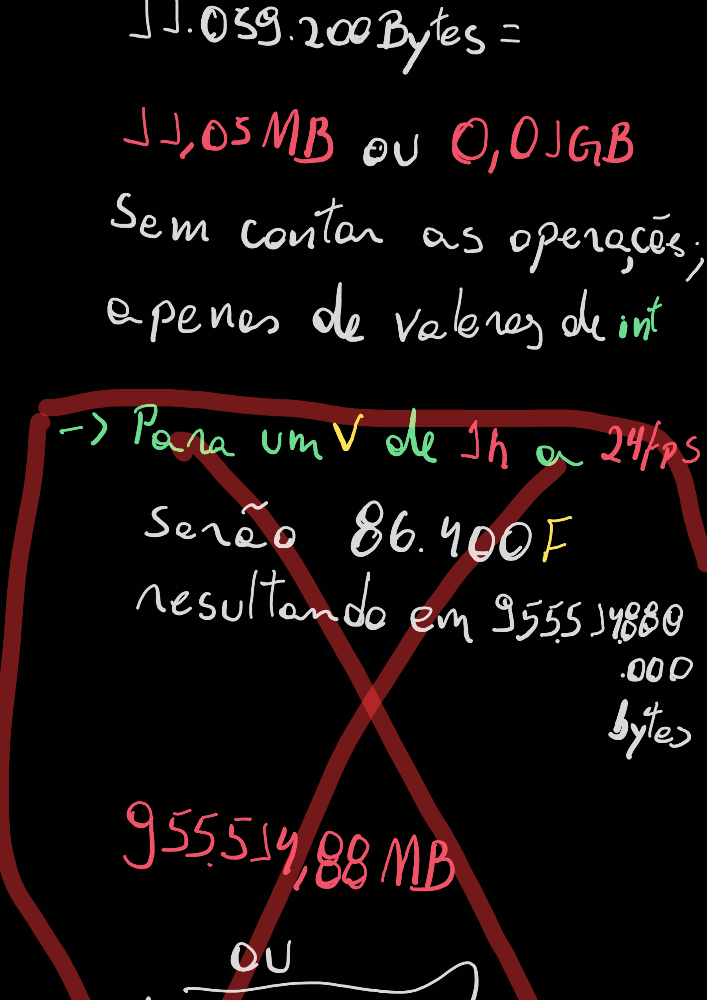
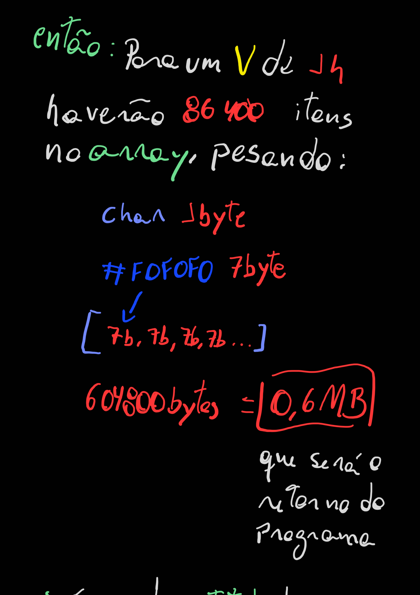

# movie-color-palet
Este programa filtra todos os pixels do de cada frame do filme e devolve uma paleta de cor baseada na media de cores de cada frame.

## Método
Este programa recebe um vídeo no formato MOV. ou MP4. e percorre todos os frames do vídeo. Ao percorre frame a frame o programa também percorre todos os pixels do frame e calcula o valor médio do RGB de cada quadro, então com o calculo concluido, a memoria é esvaziada e o valor do pixel médio é armazenado em um array de resposta a chamada do programa. Assim sucessivamente até o fim dos quadros do vídeo.

## Big-O Notation
O(log² n)
> Será melhorado quando eu conseguir no mesmo loop percorrer todos os pixel antes de de passar para o próximo quadro, reduzindo assim o número de for loops de 2 para 1 no main do projeto.

### Estudo de projeto

